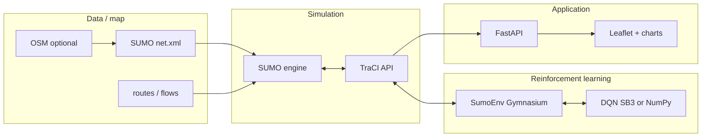
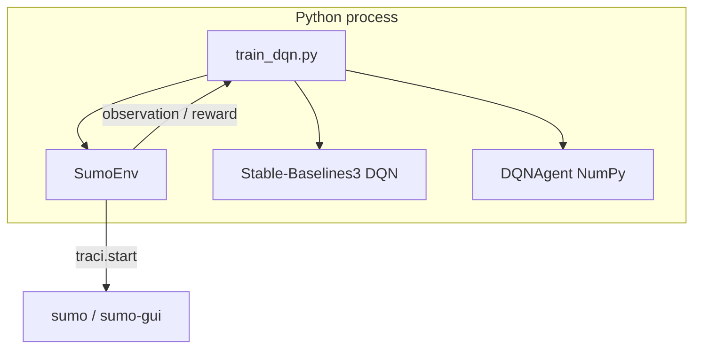
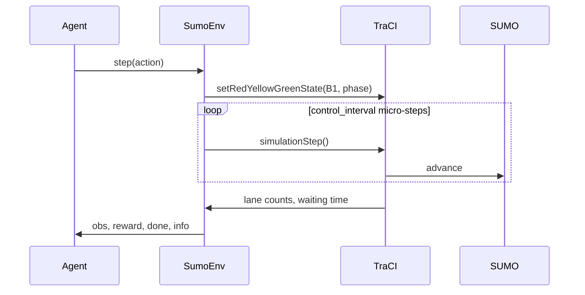
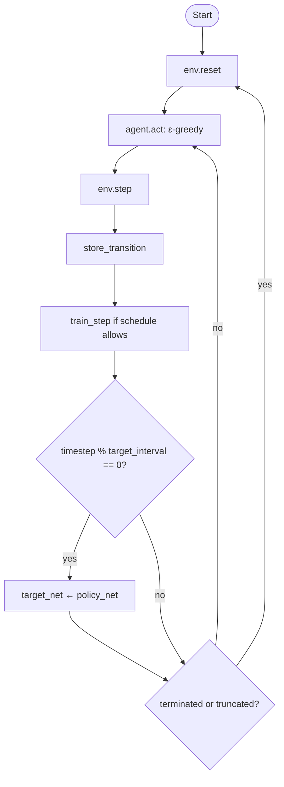
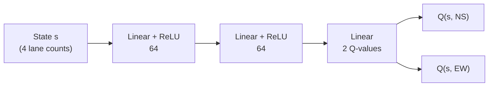
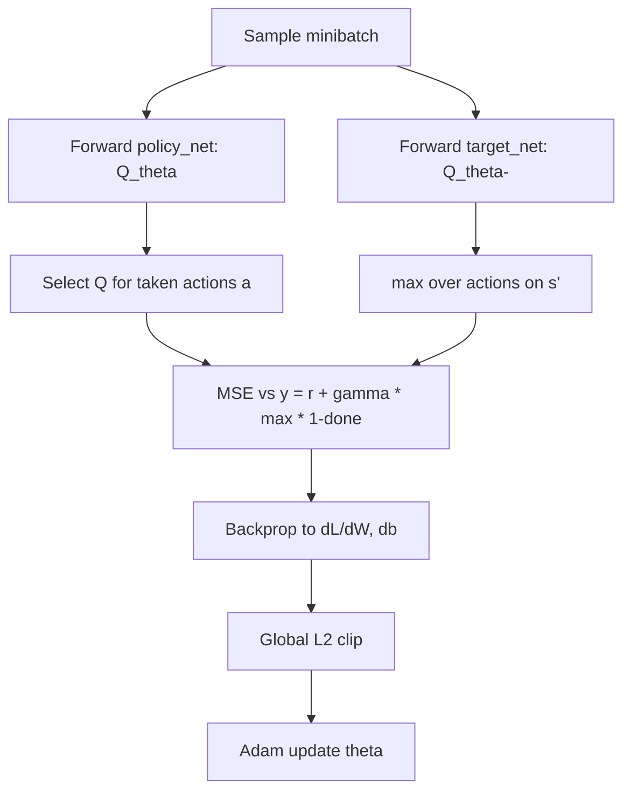

# Traffic-RL — Full Project Documentation

This document describes the **Smart Traffic Light Optimization** repository: end-to-end architecture, the **Gymnasium** SUMO environment, **DQN** training with **Stable-Baselines3**, the **NumPy DQN from scratch**, and the **mathematics** behind it. It is written for software engineering students who want both the big picture and the implementation details.

---

## 1. Project purpose and analysis

### 1.1 What the system does

The project connects **SUMO** (traffic simulation), **TraCI** (remote control API), **reinforcement learning** (DQN), and a **FastAPI + Leaflet** stack so you can:

- Simulate a **4-way intersection** (junction **B1**) with vehicles and traffic lights.
- Train an agent to choose **which direction gets green** (North–South vs East–West) from **lane occupancy** observations.
- Compare **fixed-time**, **random**, and **RL** controllers using **waiting time**, **queues**, and **speed** KPIs.
- Optionally extend the same idea to **OSM-derived** networks (`sumo_osm/`), reusing a 4-dimensional observation after padding/truncation.

### 1.2 Technology stack

| Layer | Technology | Role |
|--------|------------|------|
| Simulation | SUMO | Road network, vehicles, traffic lights |
| Control API | TraCI (`traci`) | Start sim, read lanes, set TL state |
| RL interface | Gymnasium | `reset` / `step`, spaces, rewards |
| Deep RL (library) | Stable-Baselines3 | Production DQN (`MlpPolicy`) |
| Deep RL (educational) | NumPy | Same algorithm, explicit backprop + Adam |
| Backend | FastAPI | `/run`, `/state`, `/kpis`, dashboard static |
| Frontend | Leaflet, Chart.js | Map + live charts |

### 1.3 Repository map (high level)

- **`sumo/`** — Grid intersection net, routes, `simulation.sumocfg`, manual TraCI demo.
- **`rl/sumo_utils.py`** — `SUMO_HOME`, paths, **B1** lane IDs and phase strings.
- **`rl/sumo_env.py`** — `SumoEnv`: Gymnasium wrapper around TraCI.
- **`rl/train_dqn.py`** — Train with **SB3** (default) or **scratch** via `--impl`.
- **`rl/evaluate.py`** — Compare controllers using SB3 `.zip` models.
- **`rl/from_scratch/dqn_numpy.py`** — `Network`, `ReplayBuffer`, `DQNAgent`, `DQNConfig`.
- **`rl/from_scratch/train_dqn_scratch.py`** — Standalone scratch training + logging.
- **`rl/from_scratch/evaluate_scratch.py`** — Evaluate `.npz` weights.
- **`backend/`** — KPI collection and API; can run **fixed / random / rl / rl_scratch**.
- **`frontend/`** — Dashboard polling the API.
- **`sumo_osm/`** — OSM download → net → intersection config → routes → `run_rl_agent.py`.

---

## 2. Global architecture

### 2.1 Conceptual pipeline



### 2.2 Runtime components (training)



### 2.3 One environment step (conceptual)



---

## 3. The Gymnasium environment (`SumoEnv`)

**File:** `rl/sumo_env.py` (constants in `rl/sumo_utils.py`).

| Item | Definition |
|------|------------|
| **Observation** | `Box(0, 100, shape=(4,), float32)` — vehicle counts on incoming lanes `A1B1_0`, `B0B1_0`, `B2B1_0`, `C1B1_0`. |
| **Action** | `Discrete(2)` — `0` = NS green, `1` = EW green (maps to green phase indices 0 and 2). |
| **Step** | Set phase, then call `simulationStep()` `control_interval` times (default **5** s). |
| **Reward** | \(r_t = -W_t\) where \(W_t\) is **total waiting time** (sum of `getWaitingTime` over all vehicles). Minimizing waiting ⇔ maximizing return. |
| **Termination** | Simulation time reaches `sim_end` (default **360** s) or SUMO signals end. |
| **Truncation** | `step_count >= max_steps_per_episode` (default **72**). |

This MDP is **approximate**: the state is partial (only four counts), and the reward is a global scalar, not per-vehicle shaped reward.

---

## 4. DQN with Stable-Baselines3

**Entry point:** `rl/train_dqn.py` with default `--impl sb3`.

### 4.1 What SB3 instantiates

The code builds:

```text
DQN("MlpPolicy", env, ...)
```

So the **Q-network** is a **multi-layer perceptron** mapping state → Q-values for each discrete action. The architecture is controlled by `policy_kwargs=dict(net_arch=[64, 64])`: two hidden layers of 64 units (with activations as per SB3 defaults for DQN MLP).

### 4.2 Hyperparameters aligned with this project

These mirror the NumPy agent’s intent (same `gamma`, buffer, batch, exploration schedule shape):

| Parameter | Value in code | Meaning |
|-----------|----------------|--------|
| `learning_rate` | `5e-4` | Step size for Adam (SB3 uses Adam by default for DQN policy). |
| `buffer_size` | `10_000` | Replay memory capacity. |
| `learning_starts` | `1000` | Collect random-ish experience before first gradient step. |
| `batch_size` | `32` | Minibatch size. |
| `gamma` | `0.99` | Discount factor. |
| `train_freq` | `4` | Environment steps per gradient update (when buffer ready). |
| `target_update_interval` | `500` | Every 500 env steps, **sync target network** from online net. |
| `tau` | `1.0` | **Hard update**: full copy of weights (not Polyak soft update). |
| `exploration_fraction` | `0.2` | Fraction of training time over which ε decays from start to final. |
| `exploration_final_eps` | `0.05` | Final ε after decay. |
| `net_arch` | `[64, 64]` | Two hidden layers. |

**Artifacts:** `model.save(path)` → `path.zip` (SB3 format). Evaluation: `rl/evaluate.py` loads this zip.

### 4.3 SB3 vs scratch (same experiment design)

Both implementations share:

- Same `SumoEnv` constructor arguments in `train_dqn.py` (`control_interval=5`, `max_steps_per_episode=72`, `sim_end=360`).
- Same discount, batch size, buffer size, learning start delay, train frequency, target update period, and comparable ε schedule (linear decay over 20% of total timesteps in scratch vs `exploration_fraction=0.2` in SB3).

Differences: SB3 uses **PyTorch** internally, vectorized env options, and its own logging; scratch uses **hand-written backprop** and **NumPy Adam**.

---

## 5. DQN from scratch (NumPy)

**Core file:** `rl/from_scratch/dqn_numpy.py`.

### 5.1 Modules

1. **`Network`** — Input \(\mathbb{R}^{B \times S}\) with \(S=4\), two hidden ReLU layers of size \(H=64\), output \(\mathbb{R}^{B \times A}\) with \(A=2\) (Q-values, no softmax).
2. **`ReplayBuffer`** — Cyclic arrays for \((s, a, r, s', done)\); uniform random minibatch sampling.
3. **`DQNAgent`** — Maintains **policy_net** and **target_net**; ε-greedy `act`; `train_step` implements one **Huber-free MSE** TD update (see math section); **global L2 gradient clipping**; **Adam** on all parameters.

**Training scripts:**

- `python rl/train_dqn.py --impl scratch` → saves `..._scratch.npz` when default name would clash with SB3.
- `python rl/from_scratch/train_dqn_scratch.py` — dedicated script with periodic logging.

**Evaluation:** `rl/from_scratch/evaluate_scratch.py` loads weights into `Network` and runs TraCI episodes.

### 5.2 Training loop (workflow)



### 5.3 When `train_step` runs

A gradient update happens only if:

1. `timestep >= learning_starts`, and  
2. `timestep % train_freq == 0`, and  
3. `len(replay_buffer) >= batch_size`.

---

## 6. Mathematics

### 6.1 MDP objective

The agent seeks a policy \(\pi\) maximizing expected discounted return:

\[
J(\pi) = \mathbb{E}\Big[ \sum_{t=0}^{\infty} \gamma^t r_t \Big].
\]

Here \(r_t = -W_t\) (negative total waiting time).

### 6.2 Action-value function and Bellman optimality

The **optimal Q-function** satisfies:

\[
Q^*(s,a) = \mathbb{E}\big[ r + \gamma \max_{a'} Q^*(s', a') \,\big|\, s, a \big].
\]

DQN approximates \(Q^*(s,a)\) with a neural network \(Q_\theta(s,a)\) (or equivalently a vector \(Q_\theta(s) \in \mathbb{R}^{A}\) for all actions).

### 6.3 DQN target (with target network)

For a transition \((s, a, r, s', done)\), the **bootstrap target** used in this project is:

\[
y = r + \gamma \, (1 - done) \, \max_{a'} Q_{\theta^-}(s', a'),
\]

where \(\theta^-\) are **target network** parameters, periodically copied from \(\theta\).

The **TD error** for the taken action \(a\) is:

\[
\delta = Q_\theta(s, a) - y.
\]

### 6.4 Loss (implemented: mean squared TD error)

The code minimizes:

\[
\mathcal{L}(\theta) = \frac{1}{B} \sum_{i=1}^{B} \big( Q_\theta(s_i, a_i) - y_i \big)^2.
\]

So \(\frac{\partial \mathcal{L}}{\partial Q_\theta(s_i,a_i)} = \frac{2}{B}(Q_\theta - y_i)\) for the selected action outputs (other actions in the row have zero gradient from this loss).

*Note:* Many frameworks use **Huber loss** for robustness; this implementation uses **pure MSE**, consistent with a minimal educational DQN.

### 6.5 Forward pass (shapes)

Let batch size be \(B\), state dim \(S=4\), hidden \(H=64\), actions \(A=2\).

\[
\begin{aligned}
z^{(1)} &= s W^{(1)\top} + b^{(1)}, \quad a^{(1)} = \mathrm{ReLU}(z^{(1)}) \\
z^{(2)} &= a^{(1)} W^{(2)\top} + b^{(2)}, \quad a^{(2)} = \mathrm{ReLU}(z^{(2)}) \\
Q &= a^{(2)} W^{(3)\top} + b^{(3)}
\end{aligned}
\]

Dimensions: \(W^{(1)} \in \mathbb{R}^{H \times S}\), \(W^{(2)} \in \mathbb{R}^{H \times H}\), \(W^{(3)} \in \mathbb{R}^{A \times H}\).

### 6.6 ReLU backward

For \(a = \mathrm{ReLU}(z)\), the subgradient is:

\[
\frac{\partial a}{\partial z} = \mathbf{1}[z > 0].
\]

### 6.7 Global L2 gradient clipping

Let \(g\) be the concatenation of all parameter gradients. If \(\lVert g \rVert_2 > c\) (here \(c = 10\)), replace \(g \leftarrow g \cdot \frac{c}{\lVert g \rVert_2}\). This matches the **“clip by global norm”** idea used in SB3 defaults.

### 6.8 Adam optimizer (per parameter)

For each scalar or tensor parameter \(\theta_t\) with gradient \(g_t\) at Adam step \(t\):

\[
\begin{aligned}
m_t &= \beta_1 m_{t-1} + (1-\beta_1) g_t \\
v_t &= \beta_2 v_{t-1} + (1-\beta_2) g_t^2 \\
\hat{m}_t &= \frac{m_t}{1-\beta_1^t}, \quad
\hat{v}_t = \frac{v_t}{1-\beta_2^t} \\
\theta_{t+1} &= \theta_t - \alpha \frac{\hat{m}_t}{\sqrt{\hat{v}_t} + \varepsilon}
\end{aligned}
\]

Default hyperparameters in `DQNConfig`: \(\beta_1=0.9\), \(\beta_2=0.999\), \(\varepsilon=10^{-8}\), learning rate \(\alpha = 5\times 10^{-4}\).

### 6.9 He (Kaiming) initialization

For a layer with **fan-in** \(n_{\mathrm{in}}\) feeding **ReLU** units, He init draws weights from \(\mathcal{N}(0, \sigma^2)\) with:

\[
\sigma = \sqrt{\frac{2}{n_{\mathrm{in}}}}.
\]

**Rationale:** ReLU zeros roughly half the activations on average; scaling variance by \(2/n_{\mathrm{in}}\) helps keep forward activations and backward gradients from vanishing or exploding early in training. Biases are initialized to **0**.

In code, for `w1` the fan-in is `state_size`; for `w2` and `w3` it is `hidden_size`.

---

## 7. Explaining DQN building blocks (student notes)

### 7.1 ε-greedy exploration

With probability \(\varepsilon\), pick a **random** legal action; with probability \(1-\varepsilon\), pick \(\arg\max_a Q_\theta(s,a)\). Early training needs high \(\varepsilon\) to visit diverse states; later, low \(\varepsilon\) refines a near-greedy policy. In `DQNAgent`, \(\varepsilon\) decays **linearly** from `epsilon_start` to `epsilon_end` over the first `epsilon_decay_fraction` of total timesteps.

### 7.2 Experience replay

Storing transitions in a **replay buffer** breaks temporal correlation in consecutive samples. Each update draws a **random minibatch** of past experiences, which stabilizes SGD-style optimization compared to “on-policy only last transition” updates.

### 7.3 Target network

Using \(Q_{\theta^-}\) for the max term in \(y\) reduces **moving-target** instability: if both target and predictor change every step, optimization chases a shifting objective. Periodically copying \(\theta \to \theta^-\) (here every **500** steps) is a standard **hard** target update; `tau=1.0` in SB3 matches that pattern.

### 7.4 Why Adam (not plain SGD)

Adam adapts step sizes using **momentum of gradients** and **second-moment estimates** per parameter. That often gives faster, more stable convergence in RL with noisy targets than a single global learning rate on raw gradients.

### 7.5 Why He init for ReLU MLPs

Xavier/Glorot init assumes roughly linear or tanh-like activations; **ReLU** changes the variance flow. He init corrects for the sparsity induced by ReLU, typically improving early-layer signal scale.

---

## 8. Visual: Q-network data flow (from scratch)



---

## 9. Visual: single gradient update (conceptual)



---

## 10. How to run (quick reference)

| Goal | Command |
|------|---------|
| Train SB3 DQN | `python rl/train_dqn.py` |
| Train NumPy DQN | `python rl/train_dqn.py --impl scratch` or `python rl/from_scratch/train_dqn_scratch.py` |
| Evaluate SB3 | `python rl/evaluate.py --model rl/models/dqn_traffic_light.zip` |
| Evaluate scratch | `python rl/from_scratch/evaluate_scratch.py --model rl/models/dqn_traffic_light_scratch.npz` |
| API + dashboard | `uvicorn backend.main:app --host 0.0.0.0 --port 8000` |

**Dependencies:** see `requirements.txt` (Gymnasium, NumPy, Stable-Baselines3, FastAPI, Uvicorn). **SUMO** must be installed separately (`SUMO_HOME` or PATH).

---

## 11. Further reading in-repo

- `README.md` — phased tutorial (Phases 1–9) and CLI examples.
- `rl/from_scratch/README.md` and `DQN_SCRATCH_*.md` — deeper scratch walkthroughs if present.
- `TESTING.md` — test-related notes.

---

## 12. Diagram index (browser-friendly copy)

For the same Mermaid diagrams in a standalone HTML page (no Markdown viewer required), open:

**[`docs/PROJECT_DOCUMENTATION_VISUALS.html`](PROJECT_DOCUMENTATION_VISUALS.html)**

---

*Document generated to match the repository layout and the implementations in `rl/train_dqn.py`, `rl/from_scratch/dqn_numpy.py`, and `rl/sumo_env.py` as of the documentation date.*
