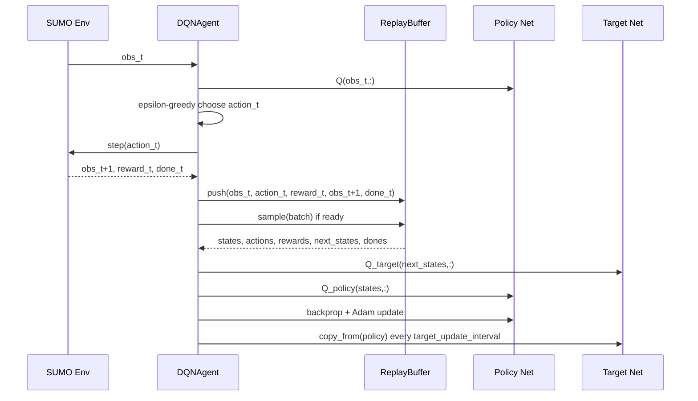
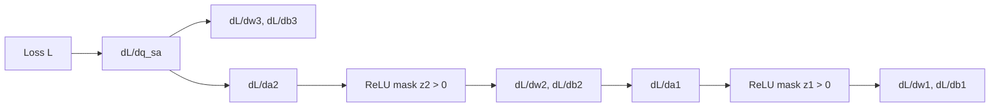

# DQN From Scratch (NumPy) - Detailed Explanation

This guide explains the from-scratch DQN agent in `rl/from_scratch` in detail:

- What each file does
- How data flows through training and evaluation
- What each concept means (Q-value, Bellman target, replay buffer, target network, epsilon-greedy, Adam, etc.)
- What key symbols/variables represent in code and math

The implementation being explained:

- `rl/from_scratch/dqn_numpy.py`
- `rl/from_scratch/train_dqn_scratch.py`
- `rl/from_scratch/evaluate_scratch.py`

---

## 1) Big Picture: What This Agent Is Solving

The traffic-light agent observes lane traffic counts and chooses one of two green-phase actions:

- `action = 0` -> first green phase
- `action = 1` -> second green phase

The goal is to maximize long-term reward (here reward is `-total_waiting`), which means reducing vehicle waiting and queues over time.

Deep Q-Learning does this by learning a function:

`Q(s, a) = expected discounted return if I take action a in state s and then act optimally`

The neural network approximates `Q(s, a)` for all actions at once.

---

## 2) File-Level Architecture

## `dqn_numpy.py`

Core RL implementation:

- `Network`: 2 hidden-layer MLP (ReLU) that maps `state -> Q-values`
- `ReplayBuffer`: cyclic experience memory
- `DQNConfig`: hyperparameter container
- `DQNAgent`: epsilon-greedy policy, TD target computation, backprop, gradient clipping, Adam update, target-network sync, save

## `train_dqn_scratch.py`

Training pipeline:

- Creates SUMO env
- Builds `DQNConfig` + `DQNAgent`
- Runs interaction loop (`act -> step -> store -> train_step`)
- Logs progress and saves weights to `.npz`

## `evaluate_scratch.py`

Evaluation/comparison:

- Runs Fixed-time controller
- Runs Random controller
- Loads saved scratch DQN model and runs greedy RL policy
- Prints KPI comparison table

---

## 3) End-to-End Flow (Visual)

```mermaid
flowchart TD
    A[Environment state s_t] --> B[Policy net forward pass Q(s_t, :)]
    B --> C{Epsilon-greedy}
    C -->|explore| D[random action]
    C -->|exploit| E[argmax_a Q(s_t,a)]
    D --> F[Execute action in SUMO]
    E --> F
    F --> G[Observe r_t, s_t+1, done]
    G --> H[Store transition in ReplayBuffer]
    H --> I{Ready to train? learning_starts/train_freq/batch_size}
    I -->|no| A
    I -->|yes| J[Sample mini-batch]
    J --> K[Compute target: y = r + gamma * max Q_target(s',a') * (1-done)]
    K --> L[Compute TD error and MSE loss]
    L --> M[Backprop gradients]
    M --> N[Global grad-norm clipping]
    N --> O[Adam parameter update on policy net]
    O --> P{target_update_interval reached?}
    P -->|yes| Q[Copy policy params -> target net]
    P -->|no| A
    Q --> A
```

---

## 4) Core RL Concepts (With Plain Meaning)

## State (`s`)

Current environment observation. In this project, state is lane vehicle counts:

- vector shape: `(4,)`
- each value: number of vehicles on an incoming lane

## Action (`a`)

Decision made by agent:

- discrete action space size `A = 2`
- maps to two allowed green phases

## Reward (`r`)

Immediate scalar feedback from environment:

- here: `reward = -total_waiting`
- lower waiting -> less negative (better) reward

## Episode termination (`done`)

Boolean indicating if episode ended (terminated or truncated).  
If `done = 1`, future return bootstrap is turned off in target computation.

## Discount factor (`gamma`)

How much future rewards matter:

- `gamma = 0.99`
- near 1.0 -> long-term planning

## Q-value

`Q(s,a)` estimates expected discounted return from taking action `a` at state `s`.

## Bellman target

Target value for DQN update:

`y = r + gamma * max_a' Q_target(s', a') * (1 - done)`

Interpretation:

- if not terminal: reward + best next-state value
- if terminal: just immediate reward

## TD error

Difference between prediction and target:

`delta = Q_policy(s,a) - y`

Learning pushes this error toward zero.

## Loss (MSE)

`L = mean(delta^2)` over batch.

## Replay buffer

Stores transitions `(s, a, r, s', done)` and samples random mini-batches.

Benefits:

- breaks temporal correlation
- reuses data efficiently
- stabilizes training

## Target network

A delayed copy of policy network used only for target computation.  
It is updated periodically, not every step.

Benefit: reduces moving-target instability.

## Epsilon-greedy exploration

Action policy:

- with probability `epsilon`: random action (explore)
- otherwise: greedy action `argmax Q` (exploit)

`epsilon` decays linearly from `1.0` to `0.05` over first 20% of timesteps.

## Gradient clipping

Global L2 norm clipping across all gradients to `max_grad_norm=10.0`.

Purpose: prevent exploding updates.

## Adam optimizer

Adaptive optimizer using:

- first moment estimate `m` (mean of gradients)
- second moment estimate `v` (mean of squared gradients)
- bias correction (`m_hat`, `v_hat`)

Parameter update:

`theta <- theta - lr * m_hat / (sqrt(v_hat) + eps)`

---

## 5) Network Internals and Shapes

The network in `Network` is:

- Input size `S = state_size`
- Hidden 1 size `H = 64`
- Hidden 2 size `H = 64`
- Output size `A = action_size`

Forward pass equations for batch size `B`:

1. `z1 = x @ w1^T + b1` -> shape `(B, H)`
2. `a1 = ReLU(z1)` -> `(B, H)`
3. `z2 = a1 @ w2^T + b2` -> `(B, H)`
4. `a2 = ReLU(z2)` -> `(B, H)`
5. `q  = a2 @ w3^T + b3` -> `(B, A)`

Weight shapes:

- `w1`: `(H, S)`
- `b1`: `(H,)`
- `w2`: `(H, H)`
- `b2`: `(H,)`
- `w3`: `(A, H)`
- `b3`: `(A,)`

Initialization:

- He/Kaiming normal: std `sqrt(2/fan_in)` for ReLU stability

---

## 6) Training Loop Explained Step-by-Step

The training script performs, per timestep:

1. `action = agent.act(obs)`
2. `next_obs, reward, terminated, truncated, _ = env.step(action)`
3. `done = terminated or truncated`
4. `agent.store_transition(obs, action, reward, next_obs, done)`
5. `loss = agent.train_step()`
6. `agent.maybe_update_target()`
7. move to `next_obs` (or reset if done)

Visual loop:



---

## 7) `train_step()` Deep Dive

`train_step()` updates parameters only when all conditions are true:

- `timestep >= learning_starts`
- `timestep % train_freq == 0`
- replay buffer has at least `batch_size` samples

If not, it returns `None`.

When it does update:

1. Sample mini-batch from replay buffer.
2. Compute policy predictions `q_values = policy(states)`.
3. Extract chosen-action predictions `q_sa = q_values[batch_idx, actions]`.
4. Compute target values using target network:
   - `max_next_q = max(target(next_states), axis=1)`
   - `targets = rewards + gamma * max_next_q * (1 - dones)`
5. Compute TD error and MSE loss.
6. Compute gradient of loss wrt chosen Q-values:
   - `grad_q_sa = (2/B) * (q_sa - targets)`
7. Backpropagate manually through:
   - output layer (`w3`, `b3`)
   - second ReLU/layer (`w2`, `b2`)
   - first ReLU/layer (`w1`, `b1`)
8. Compute global gradient L2 norm and clip if needed.
9. Apply Adam updates for all parameters.
10. Return scalar loss.

Backprop flow:



---

## 8) Hyperparameters in This Implementation

Configured in `DQNConfig` and used in training script:

- `gamma = 0.99`: long-term reward weighting
- `lr = 5e-4`: Adam learning rate
- `batch_size = 32`: samples per gradient step
- `buffer_size = 10_000`: replay capacity
- `learning_starts = 1_000`: no training before this many timesteps
- `train_freq = 4`: train every 4 timesteps
- `target_update_interval = 500`: copy policy -> target every 500 timesteps
- `epsilon_start = 1.0`: full exploration initially
- `epsilon_end = 0.05`: minimum exploration
- `epsilon_decay_fraction = 0.2`: finish linear decay by 20% of total timesteps
- `adam_beta1 = 0.9`, `adam_beta2 = 0.999`, `adam_eps = 1e-8`: Adam constants
- `max_grad_norm = 10.0`: gradient clipping threshold

---

## 9) Evaluation Logic (`evaluate_scratch.py`)

Three controllers are compared:

1. **Fixed-time**: default SUMO traffic light program
2. **Random**: random action each control step
3. **RL-scratch**: loaded DQN `.npz` model, greedy action (`argmax Q`)

For each step:

- read observation (lane counts)
- optionally choose/set action
- advance SUMO by `control_interval` simulation steps
- record KPIs:
  - `total_waiting`
  - `queue_length`
  - `avg_speed`
  - `reward = -total_waiting`

Then summary metrics are printed:

- mean waiting
- mean queue length
- mean speed
- total reward

---

## 10) Symbol and Variable Glossary (Implementation-Oriented)

This section lists key symbols used in code and equations.

## Environment/Trajectory Symbols

- `s_t`: state at time `t`
- `a_t`: action at time `t`
- `r_t`: reward received after `a_t`
- `s_{t+1}`: next state
- `done_t`: terminal flag for transition

## Batch/Shape Symbols

- `B`: batch size (`32`)
- `S`: state dimension (`4` here)
- `H`: hidden size (`64`)
- `A`: action count (`2`)

## Network Parameters

- `w1, b1`: layer 1 weights/bias
- `w2, b2`: layer 2 weights/bias
- `w3, b3`: output layer weights/bias

## Intermediate Activations

- `x`: input state batch `(B,S)`
- `z1, z2`: pre-activation vectors
- `a1, a2`: post-ReLU activations
- `q` / `q_values`: predicted Q-values `(B,A)`
- `q_sa`: chosen-action Q-values `(B,)`

## Targets/Loss

- `max_next_q`: best target Q for each next state
- `targets`: Bellman targets
- `td_error`: `q_sa - targets`
- `loss`: mean squared TD error

## Exploration

- `epsilon`: exploration probability in epsilon-greedy
- `epsilon_start/end`: decay endpoints
- `epsilon_decay_fraction`: fraction of total steps over which epsilon decays

## Replay Buffer Variables

- `state_buf`, `next_state_buf`: state storage arrays
- `action_buf`, `reward_buf`, `done_buf`: action/reward/done arrays
- `idx`: write index (cyclic)
- `size`: current number of stored transitions

## Optimizer Variables (Adam)

- `m`: first-moment accumulator
- `v`: second-moment accumulator
- `t`: Adam step counter
- `m_hat`, `v_hat`: bias-corrected moments
- `beta1`, `beta2`: exponential decay coefficients
- `eps`: numerical stability term
- `lr`: learning rate

## Gradient Variables

- `grad_q_sa`: gradient of loss wrt chosen Q predictions
- `grad_w1, grad_b1, ...`: parameter gradients
- `total_norm`: global L2 norm over all parameter gradients
- `scale`: clipping factor when `total_norm > max_grad_norm`

## Control/Training Script Variables

- `timesteps`: total interaction steps budget
- `learning_starts`: warm-up period before first update
- `train_freq`: update frequency in environment steps
- `target_update_interval`: hard target-sync period
- `ep_reward`: running episode reward accumulator
- `last_losses`: temporary list for log-window average loss

---

## 11) Why This Design Works (and Its Limits)

Why it works:

- Replay + target network are two core DQN stabilizers
- Epsilon schedule ensures exploration then exploitation
- MLP with ReLU is enough for small low-dimensional state
- Adam + grad clipping improve update robustness

Limits:

- Vanilla DQN can overestimate Q-values
- No prioritized replay
- No Double DQN / Dueling architecture
- State contains only lane counts (limited observability)
- Reward as `-total_waiting` may bias behavior in specific traffic patterns

---

## 12) Practical Reading Map

If you want to understand the code in one pass:

1. Read `DQNConfig` first (hyperparameters and defaults).
2. Read `Network.forward()` (what model computes).
3. Read `DQNAgent.act()` (behavior policy).
4. Read `DQNAgent.train_step()` line by line (learning core).
5. Read `train_dqn_scratch.py` loop to see how all methods are orchestrated.
6. Read `evaluate_scratch.py` to understand deployment/evaluation and KPI comparison.

---

## 13) Minimal Formula Cheat Sheet

- Action selection (greedy): `a* = argmax_a Q_policy(s,a)`
- Target: `y = r + gamma * max_a' Q_target(s',a') * (1-done)`
- TD error: `delta = Q_policy(s,a) - y`
- Loss: `L = mean(delta^2)`
- Adam update: `theta <- theta - lr * m_hat / (sqrt(v_hat) + eps)`

---

## 14) Training and Evaluation Commands

From project root:

```bash
python rl/from_scratch/train_dqn_scratch.py
python rl/from_scratch/train_dqn_scratch.py --timesteps 50000 --save-path rl/models/dqn_scratch
python rl/from_scratch/evaluate_scratch.py --model rl/models/dqn_traffic_light_scratch.npz --steps 72
```

---

## 15) Quick Mental Model

Think of this agent as:

1. **Predictor**: neural net predicts how good each signal phase is right now.
2. **Decision maker**: epsilon-greedy chooses random or best action.
3. **Memory learner**: replay buffer feeds random past transitions.
4. **Bootstrapped optimizer**: Bellman targets + MSE + Adam improve predictions.
5. **Stability mechanism**: target net and clipping prevent unstable learning.

If this mental model is clear, the whole implementation becomes much easier to reason about.
